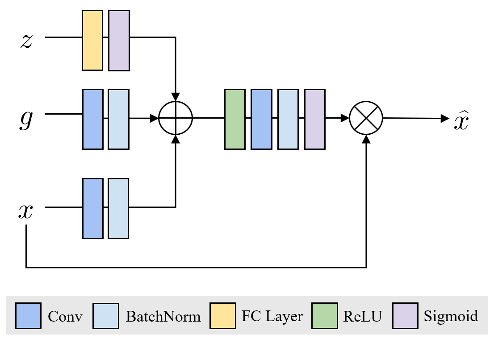
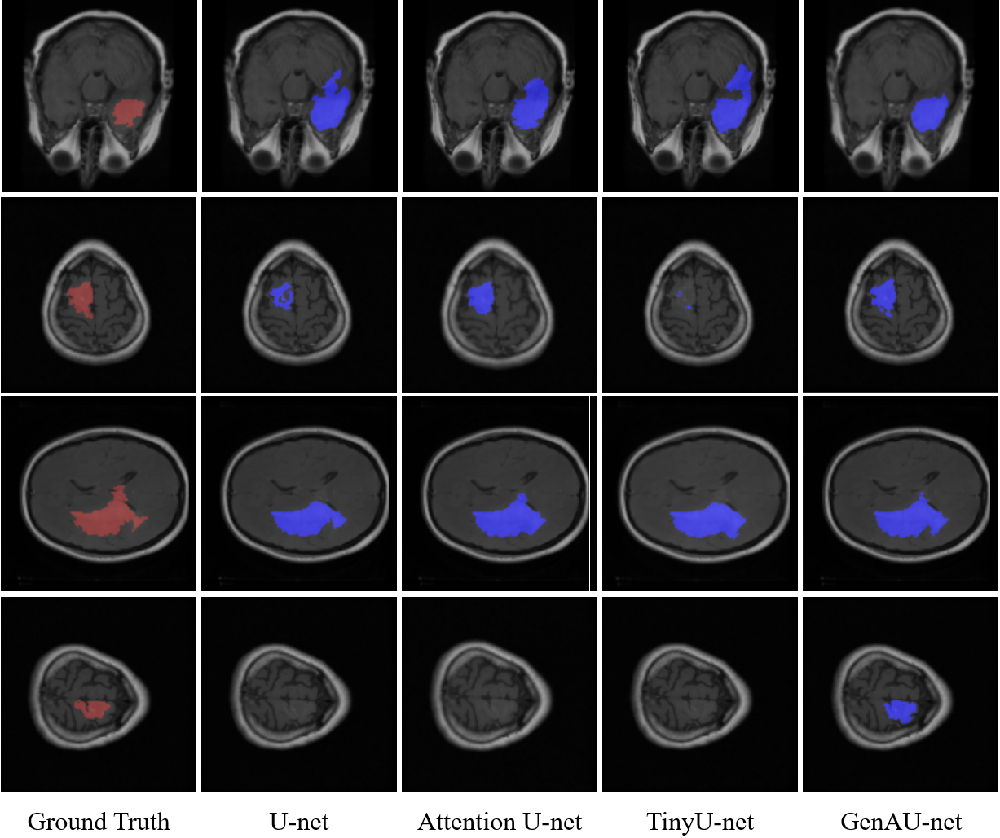

# GenAU_net

Medical image segmentation is pivotal for diagnosing and analyzing brain tumors, particularly lowergrade gliomas (LGG). Accurate tumor delineation is critical for clinical decision-making and treatment planning, yet this task remains challenging due to the complex structure of brain tissues and the heterogeneity of tumor characteristics. 
In this paper, we propose **Genomic Attention U-Net (GenAUnet)**, an enhanced segmentation framework that integrates genomic clustering data into the widely used Attention U-Net architecture. By incorporating patient-specific genomic information, GenAU-net achieves a more personalized approach to LGG MRI segmentation, demonstrating a DICE score of **0.827** on a public LGG dataset. Leveraging genomic data not only improves segmentation performance but also opens avenues for an individualized diagnosis and treatment strategy.

<!--### Genomic Attention Gate

### Visualization
-->
